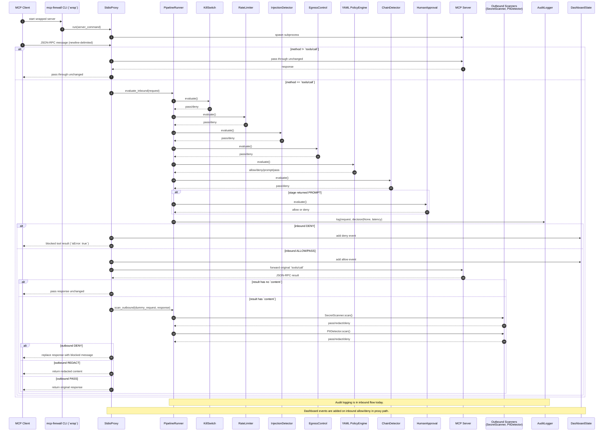

# Tool Call Sequence Diagram

This diagram shows the end-to-end `mcp-firewall` request and response flow for:

- Inbound deny
- Inbound allow
- Outbound redact/block

```mermaid
sequenceDiagram
    autonumber
    participant C as MCP Client
    participant F as mcp-firewall CLI (`wrap`)
    participant P as StdioProxy
    participant R as PipelineRunner
    participant K as KillSwitch
    participant L as RateLimiter
    participant I as InjectionDetector
    participant E as EgressControl
    participant Y as YAML PolicyEngine
    participant D as ChainDetector
    participant H as HumanApproval
    participant S as MCP Server
    participant O as Outbound Scanners<br/>(SecretScanner, PIIDetector)
    participant A as AuditLogger
    participant DB as DashboardState

    C->>F: start wrapped server
    F->>P: run(server_command)
    P->>S: spawn subprocess

    C->>P: JSON-RPC message (newline-delimited)

    alt method != `tools/call`
        P->>S: pass through unchanged
        S-->>P: response
        P-->>C: pass through unchanged
    else method == `tools/call`
        P->>R: evaluate_inbound(request)

        R->>K: evaluate()
        K-->>R: pass/deny
        R->>L: evaluate()
        L-->>R: pass/deny
        R->>I: evaluate()
        I-->>R: pass/deny
        R->>E: evaluate()
        E-->>R: pass/deny
        R->>Y: evaluate()
        Y-->>R: allow/deny/prompt/pass
        R->>D: evaluate()
        D-->>R: pass/deny

        alt stage returned PROMPT
            R->>H: evaluate()
            H-->>R: allow or deny
        end

        R->>A: log(request, decision|None, latency)

        alt inbound DENY
            P->>DB: add deny event
            P-->>C: blocked tool result (`isError: true`)
        else inbound ALLOW/PASS
            P->>DB: add allow event
            P->>S: forward original `tools/call`
            S-->>P: JSON-RPC result

            alt result has no `content`
                P-->>C: pass response unchanged
            else result has `content`
                P->>R: scan_outbound(dummy_request, response)
                R->>O: SecretScanner.scan()
                O-->>R: pass/redact/deny
                R->>O: PIIDetector.scan()
                O-->>R: pass/redact/deny

                alt outbound DENY
                    P-->>C: replace response with blocked message
                else outbound REDACT
                    P-->>C: return redacted content
                else outbound PASS
                    P-->>C: return original response
                end
            end
        end
    end

    Note over A,R: Audit logging is in inbound flow today.
    Note over DB,P: Dashboard events are added on inbound allow/deny in proxy path.
```
